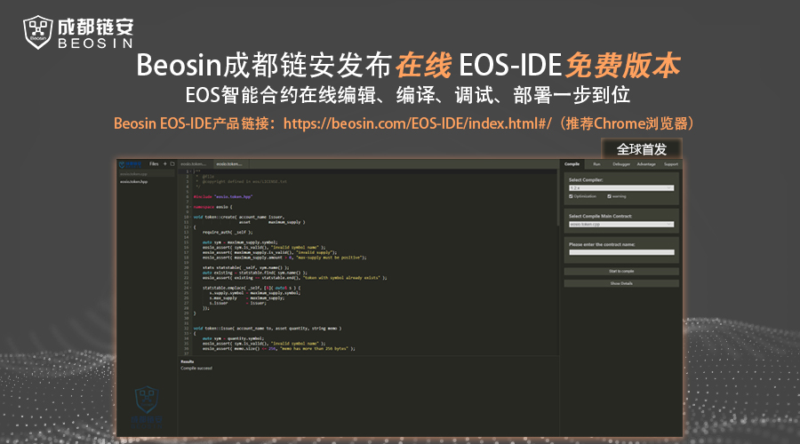
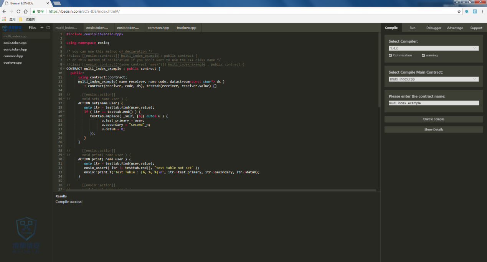
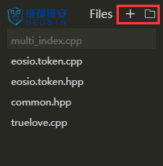
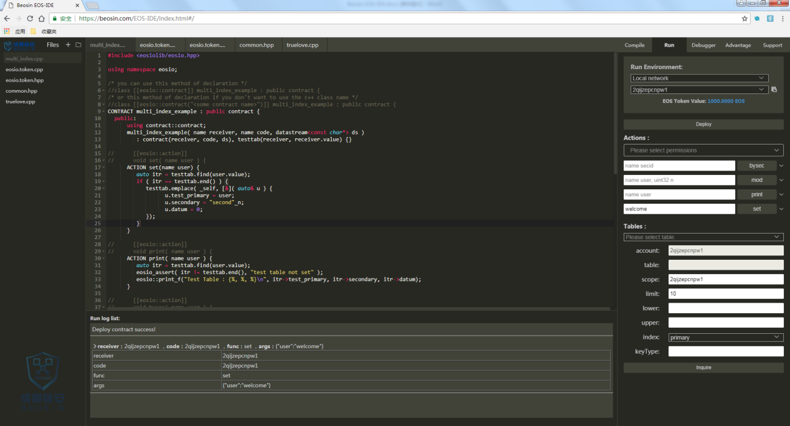
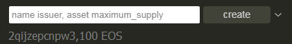
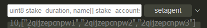

**Beosin成都链安发布在线EOS-IDE免费版本  EOS智能合约在线编辑、编译、运行调试、部署一步到位**

 

 

Beosin EOS-IDE产品链接：

[https://beosin.com/EOS-IDE/index.html#/](#/)

（推荐Chrome浏览器）

 

 

 

每一个区块链开发的程序员都需要一个界面友好，操作方便的IDE，EOS开发也是一样。但是，目前，在EOS平台上开发应用程序门槛高、难度大，缺乏一个功能完善，便于使用的EOS应用开发环境。

 

**为此，Beosin成都链安今日发布了EOS智能合约集成开发环境“Beosin EOS-IDE”，该产品同时支持EOS智能合约在线编辑、编译、一键部署和调试等多种功能，供所有开发者免费使用。**

 

Beosin EOS-IDE相比其他EOS离线开发工具，**最大的优势**在于以下8点：

 

1、首款具备在线编辑、编译、运行调试、部署于一体的EOS开发工具

 

2、无需搭建开发环境，无需安装，在线操作

 

3、一切交互均以图形化方式

 

4、支持多个编译器版本

 

5、支持多种EOS节点部署运行

 

6、运行速度快、提示信息明确，极大提升了用户体验

 

7、开发人员可以高效完成EOS智能合约开发等工作

 

8、协助开发者在开发过程中提高漏洞风险意识，避免安全隐患

 

Beosin EOS-IDE的推出使EOS应用开发更简单、更方便，欢迎大家免费体验：通过浏览器访问[https://beosin.com/EOS-IDE/index.html#/](#/)（推荐Chrome浏览器）。**为推动EOS全生态发展，Beosin EOS-IDE已首发EOSPark**。（EOSPark官网链接https://eospark.com/）

 

 

**Beosin EOS-IDE界面简介：**

 

下面我们将介绍使用 Beosin EOS-IDE 编辑器来开发智能合约。Beosin EOS-IDE 是一个浏览器版的IDE，您可在浏览器访问[https://beosin.com/EOS-IDE](#/)，如图1-1 为Beosin EOS-IDE界面:

 

 

图1-1 Beosin EOS-IDE界面

 

如图1-1 为Beosin EOS-IDE界面和大多数IDE一样，最左边是文件浏览，中间是代码编辑区域，右边是功能区域，下边是日志区域。

 

 

**操作步骤：**

### 1.1 加载本地磁盘文件及新增文件

在文件浏览区域上有如图1-2红框处两个图标，点击左侧图标创建新增文件名称，点击右侧图标选择打开本地文件。

 

 

如图 1-2 Beosin EOS-IDE文件浏览区

 

选择文件后可以右击对文件进行重命名或者删除操作。

### 1.2 编辑

IDE中上方是EOS智能合约编辑器区域。支持代码展开及合并，支持代码联想功能。

### 1.3 编译

在右边的功能区域选择Compile页签，会动态的显示当前编辑区域合约的编译信息，如显示错误和警告。编译成功后可点击Details查看ABI接口返回的详细信息。

 

编译器版本分为1.2.x、1.3.x、1.4.x、1.5.x四个版本。

 

注:若主合约与文件名不相同，请填写正确的合约名称。

 

### 1.4 部署

编译成功后进入run页签，选择账户及要部署的网络点击Deploy进行部署，网络包含：Local network、Test network、Main network，部署在测试网或主网时，浏览器需要安装钱包插件。部署结果将在中部下方Run log list中展示。

 

 

可以根据不同账户部署不同合约，无需二次部署即可直接运行。

### 1.5 运行

部署合约成功后，页面返回函数信息及设置账户权限、Tables查询功能，录入函数参数信息即可运行该函数。运行结果将在Run log list中展示。每运行一次都会在Run log list生成一条记录。点击“Inquire”按钮可以查询后台Tables数据信息。

 

 

参数录入规则：

1、多个参数以“,”分割。

 

2、asset类型参数录入int64_t和symbol_type以空格分开

 

3、数组参数录入见下图：

 

 

**开发建议：**

 

Beosin成都链安提醒所有开发者在合约开发前，应进行智能合约相关漏洞风险知识学习，了解最新的智能合约安全漏洞，避免开发的合约中存在安全隐患。

 

在开发过程中，当编译工具对合约中不符合最新规范的代码提出告警时，开发者需要对告警引起重视，强烈建议开发者更改自己的代码，以消除编译过程中的告警。

 

在合约编写完成后，开发者需要对合约功能的完整性和安全性进行测试，确保合约逻辑实现与设计相符，确保无安全风险。最后，可以寻找专业的智能合约审计团队进行合约审计，最大程度地减少安全隐患。

 

**关于Beosin（成都链安）：**

 

Beosin成都链安专注于区块链全生态安全，其核心技术为形式化验证，是全球最早一批将此技术应用到区块链安全领域的公司，自主研发出全球首个同时支持ETH、EOS、Fabric、ONT、TRON等多个区块链平台的高度自动化的智能合约形式化验证平台VaaS，准确率达到95%以上，相关研究成果已申请多项软件发明专利。

 

公司首批入选Etherscan智能合约审计推荐名单及普华永道创新加速器，荣获全国首届中小微企业SaaS应用创新创业大赛冠军，获得OKEx最佳安全审计合作伙伴奖等荣誉，参加工信部多项区块链安全标准的撰写，入选工信部“2018区块链白皮书”，作为唯一安全公司入选“2018中国区块链企业百强榜”，荣膺金色财经“2018年度最专业安全服务机构”。已与Huobi、KuCoin、ONT、Qtum、比原链、Wanchain、麦子钱包、EOSPark等共计超过40家区块链公司建立战略合作关系，审计报告被国内外各大知名交易所认可。审计智能合约超500份，独立发现区块链安全漏洞10余个，获得行业及客户的一致好评和认可。公司提供智能合约安全审计、钱包安全加固与审计、DApp安全加固与审计、交易所安全检测、企业级安全服务等全生态安全业务。让区块链全生态更安全，是我们的美好愿景！

 

 

 

 

 

 

 

 

 

 

 

 

 

 

 

 

 

 
