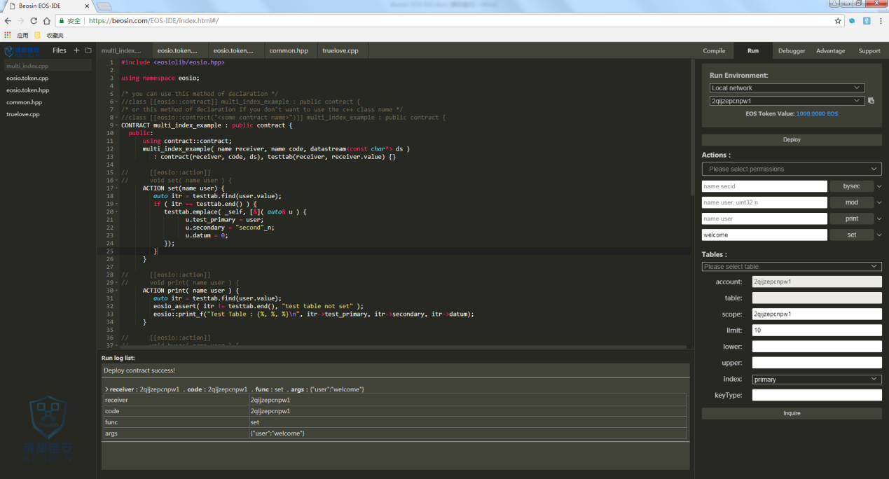
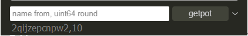
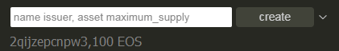

Beosin EOS-IDE Link: 

<https://beosin.com/EOS-IDE/index.html#/>

(recommend Chrome)

 

 

**Beosin (Chengdu LianAn) published online EOS-IDE free version “one step EOS smart contract online edit, compile, debug, one-button deploy”**

 

 

On the present EOS market environment, there is no development tool with perfect functions for EOS. For that, Beosin (Chengdu LianAn) published EOS smart contract Integrated Development Environment “Beosin EOS-IDE” today. This product supports functions including smart contract online edit, compile, one-button deploy and debug. Compare with other offline EOS development tools, the most prominent advantages are as follow: 

 

\1. It is the first online edit, compile, debug, deploy set in one-scale EOS development tool.

 

\2. Without building development environment and installing, online operation; 

 

\3. All the interactions is graphically shown; 

 

\4. Supports multiple compiler version; 

 

\5. Supports deploying and running on multiple EOS node; 

 

\6. Faster running speed, clear message remind and improving users’ experience.

 

\7. Developers can efficiently finish EOS smart contract development, etc.

 

\8. Assists developers to enhance vulnerability risk awareness and avoid potential security hazards in the development process.

 

As a result of publishing “Beosin EOS-IDE”, improving users’ experience and making EOS Dapp development simpler, more convenient. Welcome to experience it for free: visit it(https://beosin.com/EOS-IDE/index.html#/) on browser(as shown below, recommend Chrome browser). Aiming to promote the development of EOS ecosystem, “Beosin EOS-IDE” has been published firstly on EOSPark.（https://eospark.com/）

 

 

**Beosin EOS-IDE** **I****nterface** **I****ntroduction**

 

Here are some instructions of using “Beosin EOS-IDE” editor to develop smart contract. Beosin EOS-IDE is an IDE working on browser,, you can use it via visiting <https://beosin.com/EOS-IDE>. Figure 1-1 shows the interface of “Beosin EOS-IDE”:

 

 

Figure 1-1 Beosin EOS-IDE Interface

 

Like other IDEs, the interface of “Beosin EOS-IDE” is designed as follows: file browsing area on the left, code editing area in the middle, and function area on the right, plus the log area at the bottom.

 

**Operation Step****s****:**

1.1 Load local files and create new files

 

There are 2 icons on the upper right of file browsing area as shown in Figure 1-2 which are circled in red. Click the left icon to create a new file, the right icon is for opening a local file.

 

 

Figure 1-2 Beosin EOS-IDE File Browsing Area

 

 

1.1 After selecting file, you can right-click to rename or delete it. 

 

1.2 Edit

 

The center of IDE is the smart contract editing area, which supports code expansion, merging, and association function.

 

1.3 Compile

 

Selecting “Compile” tab on the right function area will dynamically show the compiling information of the contract in the current editing area such as Errors and Warnings. After successful compiling, you can click “Details” to check the detailed information returned by ABI.

 

 

Now 4  versions of compilers are supported: 1.2.x, 1.3.x, 1.4.x, 1.5.x 

 

1.2 Note: if the main contract name is different with file name, please check and rectify the contract names to make they are consistent. 

 

1.4 Deploy

 

After successful compiling, switch to “run” tab toselect the account and the network for deployment, then click “Deploy” to proceed. The network includes Local network, Test network and Main network. When the contract is deployed on Test network or Main network, Wallet plug-ins need to installed in the browser. The deployment results will be shown on “Run log list”.

 

 

 

Support deploying different contracts according to different accounts. All contracts can be run directly without secondary deployment. 

1.5 Running 

 

After successful deployment contract, the function area on the right will return the information on the functions and provide operations including setting account access, Tables query. Inputting corresponding parameters of functions will be enough to run this function. The results will be shown on the “Run log list”. Each time you running it will generate a record on the “Run log list”. Click “Inquire” bottom to query the backend data information of Tables.

 

Input rules for parameters:

 

\1. To input multiple parameters, commas (“,”) is required to separate these values. 

 

 

\2. In the case of inputting int64_t and symbol_type, which are asset type of parameters, please use blank space to separate them.

 

 

\3. As for inputting array type of parameters, an example has been shown as below.

 

 

 

**Development suggestions:**

 

Beosin（Chengdu LianAn）reminds all the developers, before the contract development, should learn the vulnerability risk about smart contract and the newest smart contract security vulnerabilities to avoid hidden security danger exist in developed contracts.

 

During the process of development, when compiler alerts code in the contract that does not conform to the latest specifications, developers need to pay attention to alarms, and it is strongly recommended that developers change their code to eliminate alarms during compilation.

 

After finishing contract, developers need to test the completeness and the security for contract function, ensure that contract logic implementation is consistent with design without security risk. Lastly, for reducing security danger as much as possible, searching professional smart contract audit team for auditing is recommended. 

 

**About Beosin(****Chengdu LianAn****)****:**

 

Beosin(Chendu LianAn) focus on blockchain full ecological security and the core technology is formal verification, it is the world's first apply this technology to the blockchain security. Research out the Vaas platform which is the world's first automated blockchain formal verification tool that supports multiple blockchain platforms including ETH, EOS, Fabric, ONT, TRON, etc. Functional correctness of smart contracts and other blockchain applications with a minimum accuracy of 95%. Related research results have applied for a number of software invention patents.

 

It was selected into recommended list of audit and security for smart contracts by Etherscan as first. And then selected into PwC's Accelerator. Won the championship of the first National “SaaS” Application Innovation and Entrepreneurship Competition for small and medium-sized enterprises. Received the OKEx Best Security Audit Partner Award. Participated in setting the ITU Blockchain Standards and selected into MIIT “2018 Blockchain Whitepaper”. Selected in “2018 China Blockchain Enterprise Top 100 List” and received the Cointime “2018 year's most professional security services” as the only security company. Established cooperation relationships with more than 40 blockchain companies including Huobi, KuCoin, ONT, Qutm, Bytom, Wanchain, Math Wallet, EOSPark, etc. The audit report is acceptable by famous Exchanges around the world. Over 500 smart contracts were audited and exposed more than 10 vulnerabilities, obtained the praise and recognition of industry and customers. Company provides ecological security services such as smart contract security audit, wallet security reinforcement and audit, DApp security reinforcement and audit, Exchange security inspection, enterprise-level security services, etc. Let the blockchain full ecology more secure, is our beautiful vision!

 

 

 

 

 

 

 

 

 

 

 

 

 

 

 

 